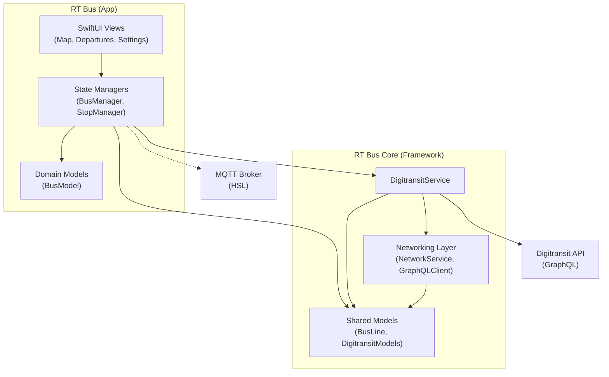

# System Architecture

## Overview

The application is structured using a modular architecture to separate the main application logic (UI, State) from shared infrastructure (Networking, Data Models).

### Modules

1. **RT Bus (App Integration)**
   - **Role**: Main application target.
   - **Responsibility**: Hosting Views, managing App State, and coordinating specific business logic.
   - **Dependencies**: `RT Bus Core`, `MQTTNIO`.

2. **RT Bus Core (Framework)**
   - **Role**: Shared infrastructure framework.
   - **Responsibility**: Networking, API clients, and reusable data models.
   - **Dependencies**: Foundation, OSLog, CoreLocation.

## Diagram

## Data Flow

1.  **Transport Data**: `BusManager` connects to the external MQTT broker to receive real-time vehicle updates.
2.  **Static Data**: `DigitransitService` (in Core) fetches stop and route data via GraphQL.
3.  **State Management**: Managers in the App layer aggregate data from both MQTT and Core services to drive the UI.
